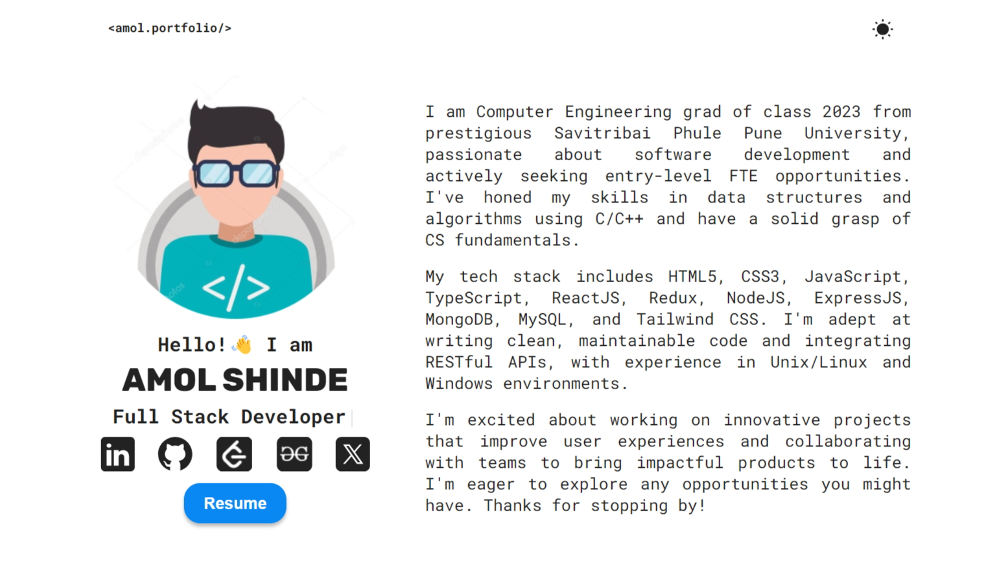
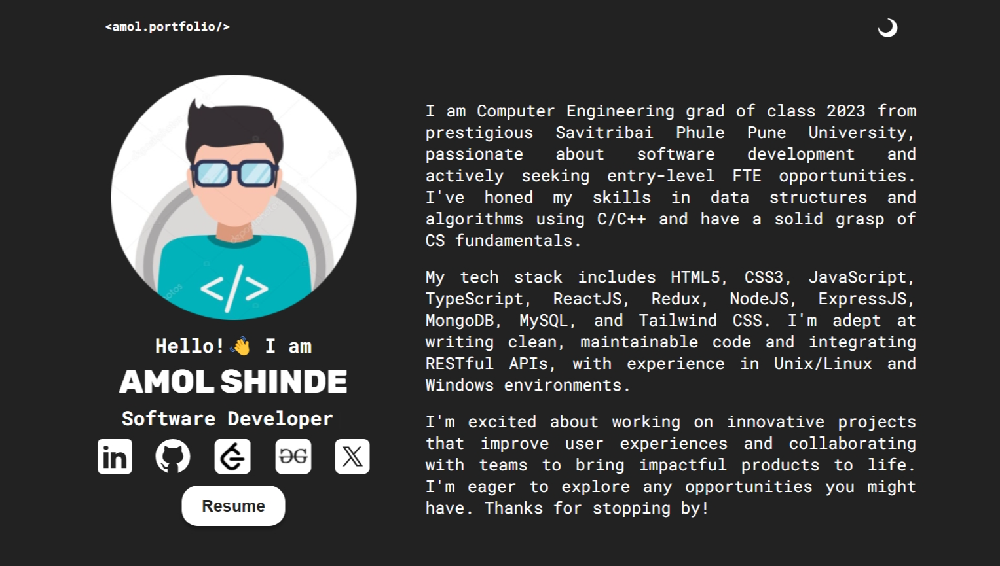
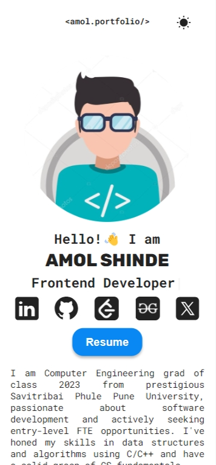
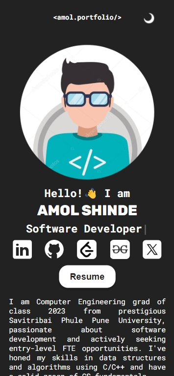

# ✨❄️💙 My Portfolio Site 💙❄️✨

Welcome to my personal portfolio website! This project showcases my skills, projects, and experience in web development. The site is built using React and Vite, offering a fast and modern web experience.

## 

## Screenshots 📸

💻Desktop views :

📱Mobile views:

## 🛠️ Tech Stacks

- **Frontend:**
  - React
  - Vite
  - CSS Modules
- **Tools:**
  - ESLint for linting
  - Vite for bundling

## 🚀 Features

- **Projects Section:** Showcases various projects I have worked on, with live demos and GitHub links.
- **Responsive Design:** Fully responsive design that looks great on all devices.
- **Smooth Animations:** Enhanced with smooth animations for an engaging user experience.
- **Typed.js Integration:** Dynamic text animation using react-typed.
- **Dark Mode and Light Mode:** Toggle between dark and light themes for a better viewing experience based on your preference.

## 👤 Author

Portfolio is crafted with 💙 by **Amol**.
